

# TASK 1 [Problem `1` to Problem `6` ]
>Note:  In this submission we implemented our utils functions from scratch in python, like what was asked in cpp, but according to the new guidlines we will vectorize our functions utilizing numpy in the final submission ISA.

> the histogram was implemented from scratch 
> - `draw_histogram_scratch` in problem 4 and all visualizations of histograms 
> - `get_histogram` in problem 5 & 6 which is used in all the calculations 
>
> we will remove this dublication ISA

# Problem 1 [Adding Additive Noise]

## Uniform Noise

  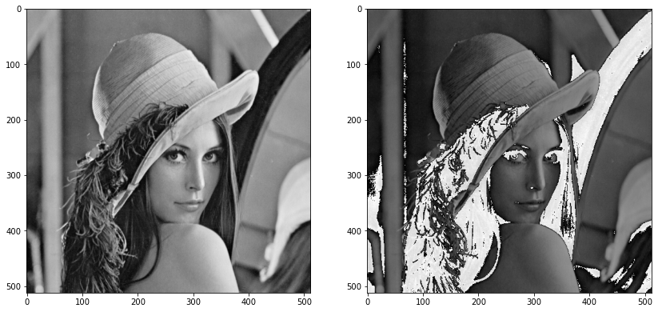   

 
 ## Salt and Pepper Noise

  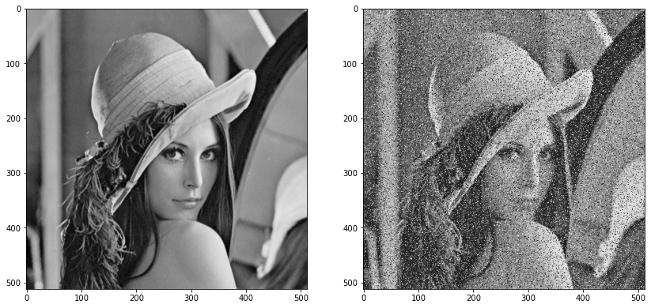   

 
 ## Gaussian Noise

  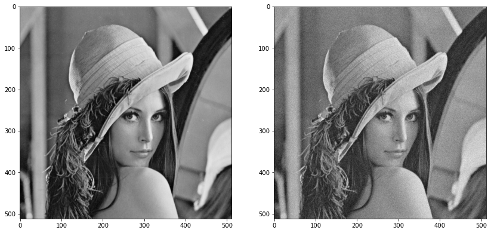   

 

 # Problem 2 [Filtering Noise]

## Average Filter

  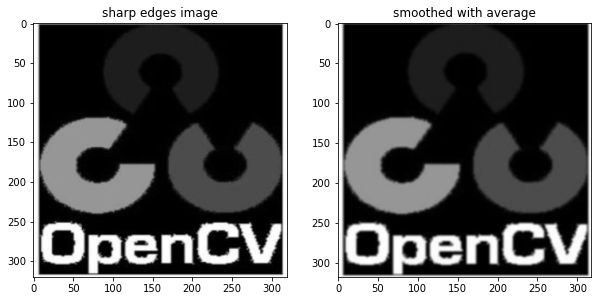   

 
 ## Median

  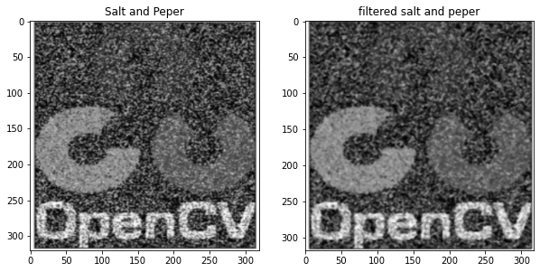   

 
 ## Gaussian Noise

  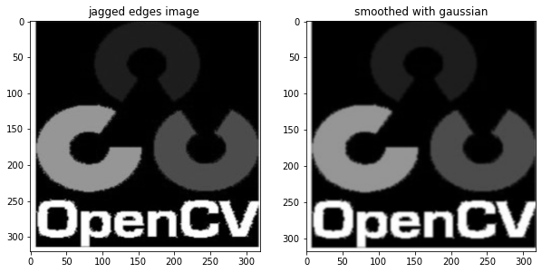   

# Problem 3 [Edge Detection (Sobel , Roberts , Prewitt and Canny) ]

## Sobel , Roberts , Prewitt

  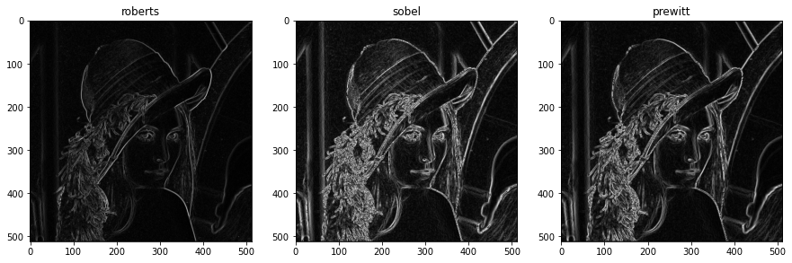   

 
## Canny Edges

  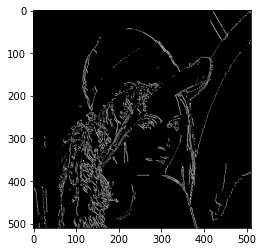   

 
# Problem 4 [Histogram and Distribution Curves]

  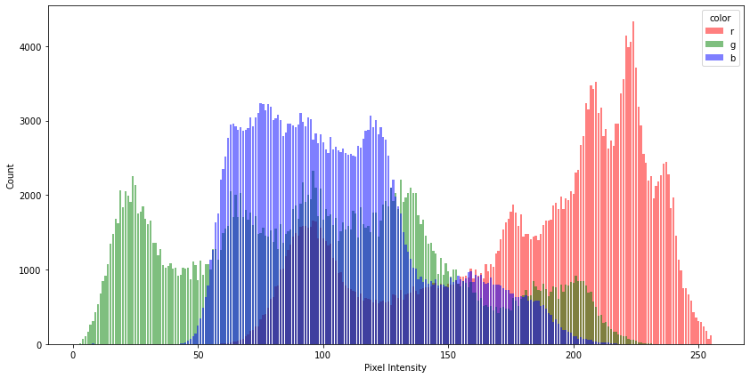   

 

  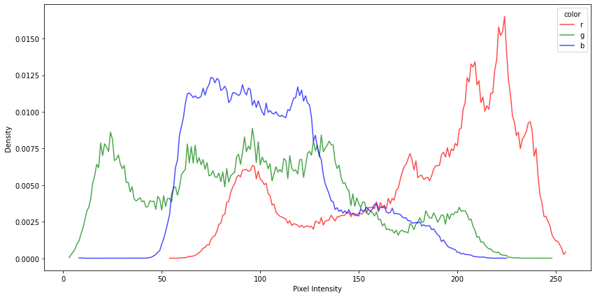   

 
 

  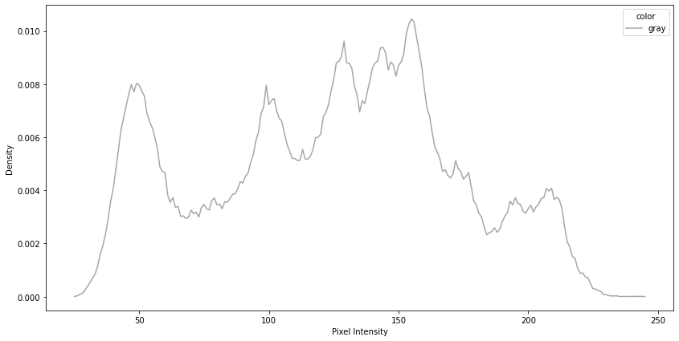   

# Problem 5 [Equalizing Images]

## Cummulative sum for generating image CDF used in equalization

  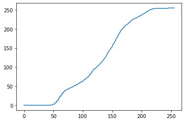   

## Image histograms before and after equalization

  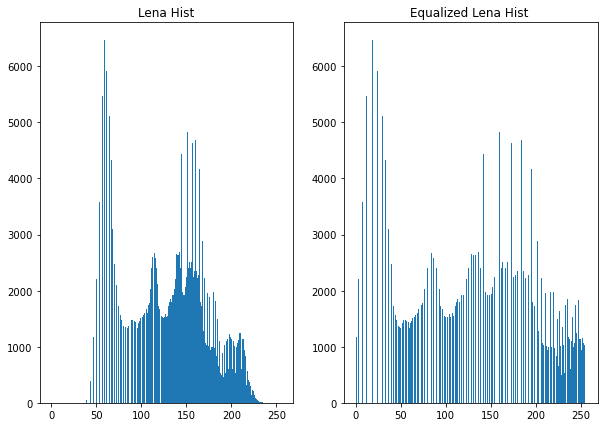   

 
 

  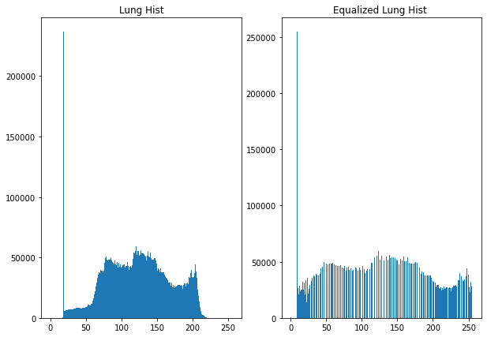   

## Images before and after equalization (contrast enhancement)

  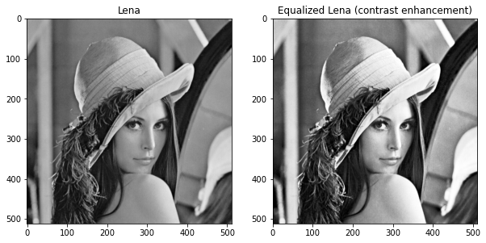   

 
 

  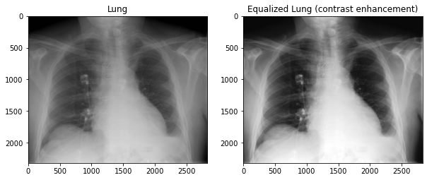   

## Problem 6 [Normalizing Images]

  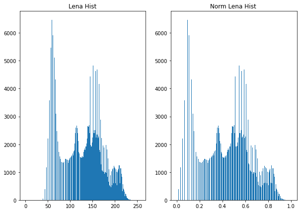   

 
 

  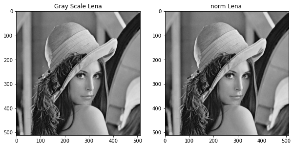   

