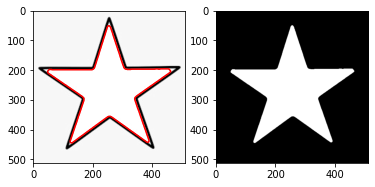

```python
import cv2
from hough_utils import *
```

# 1) Hough transform for detecting circles 

## 1.1) Single circle


```python
file_path = "./res/ex1.png"
img = cv2.imread(file_path, cv2.IMREAD_GRAYSCALE)
img = cv2.Canny(img,50,150)
res = detectCircles(img,9,30,radius = [160,140])
displayCircles(res, file_path)
```

    finished....
    


    

    


## 1.2) Multiple circles with same radius 


```python
file_path = "./res/ex2.png"
img = cv2.imread(file_path, cv2.IMREAD_GRAYSCALE)
img = cv2.Canny(img,50,150)
res = detectCircles(img,8,40,radius = [80,60])  
displayCircles(res, file_path)
```

    finished....
    


    

    


## 1.3) Multiple circles with different radius


```python
file_path = "./res/HoughCircles.jpg"
img = cv2.imread(file_path, cv2.IMREAD_GRAYSCALE)
img = cv2.Canny(img,50,150)
res = detectCircles(img,12,15,radius = [60,2])
displayCircles(res, file_path)
```

    finished....
    


    

    


# 2) Hough transform for lines detection

## 2.1) visualizing accumulator array


```python
image_name = "res/pantagon.png"

# Loads an image
csrc = cv2.imread(cv2.samples.findFile(image_name), cv2.IMREAD_COLOR)
graysrc = cv2.cvtColor(csrc, cv2.COLOR_BGR2GRAY)


edges = cv2.Canny(graysrc,150,200)
acc, rhos,thetas = hough_line_accumulator(edges)
indices = hough_simple_peaks(acc, 5)
plot_hough_accumulator(acc)

```


    

    


## 2.2) detect lines in pantagon shape 


```python
import matplotlib.pyplot as plt
import numpy as np

image_name = "res/pantagon.png"

# Loads an image
src = cv2.imread(cv2.samples.findFile(image_name), cv2.IMREAD_GRAYSCALE)
src_colored = cv2.cvtColor(src, cv2.COLOR_GRAY2BGR)

edges = cv2.Canny(src,150,250)
csrc = cv2.cvtColor(src, cv2.COLOR_GRAY2BGR)


H, thetas , rhos = hough_line_accumulator(edges)
indices = hough_simple_peaks(H, 20)
hough_lines_draw(csrc, indices, rhos, thetas)

```


```python
fig, axs = plt.subplots(1,3,figsize=(15,15))
axs[0].imshow(src_colored)
axs[1].imshow(edges)
axs[2].imshow(csrc)

```


    <matplotlib.image.AxesImage at 0x25d41b46520>


    

    


## 2.3) detect lines in sudoku shape


```python
import matplotlib.pyplot as plt
import numpy as np

image_name = "res/sudoku.png"

# Loads an image
src = cv2.imread(cv2.samples.findFile(image_name), cv2.IMREAD_GRAYSCALE)
src_colored = cv2.cvtColor(src, cv2.COLOR_GRAY2BGR)

edges = cv2.Canny(src,50,150)
csrc = cv2.cvtColor(src, cv2.COLOR_GRAY2BGR)


H, thetas , rhos = hough_line_accumulator(edges)
indices = hough_simple_peaks(H, 30)
hough_lines_draw(csrc, indices, rhos, thetas)

```


```python
fig, axs = plt.subplots(1,3,figsize=(15,15))
axs[0].imshow(src_colored)
axs[1].imshow(edges)
axs[2].imshow(csrc)

```


    <matplotlib.image.AxesImage at 0x25d42004730>


    

    


# 3) Active Contour


```python
import snake
import matplotlib.pyplot as plt

%matplotlib inline
```


```python
image = cv2.imread( "images/example.jpg", cv2.IMREAD_COLOR)

snake = snake.Snake( image, closed = True )

snake.set_alpha = 50
snake.set_beta = 50
snake.set_delta = 10
snake.w_line = 50
snake.w_edge = 50
snake.w_term = 50


# Apply gradient descent
for i in range(100):
    snake_changed = snake.step()

snakeImg = snake.visualize()    
    
plt.imshow(snakeImg, cmap='gray');

```

    C:\Users\galloul\anaconda3\lib\site-packages\numpy\core\fromnumeric.py:86: RuntimeWarning: overflow encountered in reduce
      return ufunc.reduce(obj, axis, dtype, out, **passkwargs)
    


    

    


```python
import snake

# Loads the another image
image2 = cv2.imread( "images/example2.jpg", cv2.IMREAD_COLOR )

snake = snake.Snake( image2, closed = True )

snake.set_alpha = 50
snake.set_beta = 50
snake.set_delta = 10
snake.w_line = 50
snake.w_edge = 50
snake.w_term = 50


for i in range(200):
    snake_changed = snake.step()

snakeImg = snake.visualize()    
    
plt.imshow(snakeImg, cmap='gray');

```


    

    


```python
from snake import adaptive_thresholding
gry = cv2.cvtColor(image2, cv2.COLOR_BGR2GRAY)
plt.imshow(gry, cmap='gray')
```


    

    


# Active Contour (Morphological Snakes) 


```python
import matplotlib.pyplot as plt
from scipy import ndimage, misc
import matplotlib.image as mpimg
import numpy as np 
import cv2 as cv

import morphsnakes as ms
from imageio import imread
from contour_util import rgb2gray

from contour_util import gradient_detector_azoz, comparison_plot, gaussian_fft_filter, inverse_gaussian_gradient
```


```python
# scipy function to calc gaussian gradient magnitude to compare our implementation
ascent = misc.ascent()
result = ndimage.gaussian_gradient_magnitude(ascent, sigma=5)
comparison_plot(ascent, result)

```


    

    


## Inverse Gaussian Gradient `gimage`
a preprocessed version of the original image that enhances and highlights the borders (or other structures) of the object to segment. `morphological_geodesic_active_contour` will try to stop the contour evolution in areas where `gimage` is small.  


```python
ascent = misc.ascent()
ascent_lpf, _ = gaussian_fft_filter(ascent, 20)
mag, phase = gradient_detector_azoz(ascent_lpf)

comparison_plot(result, mag)
# left scipy                            # right ours
```


    

    


-  The classic snakes provide an accurate location of the edges only if the initial contour is
given sufficiently near the edges because they make use of only the local information along the
contour.
-  Estimating a proper position of initial contours without prior knowledge is a difficult
problem. 
- Also, classic snakes cannot detect more than one boundary simultaneously because
the snakes maintain the same topology during the evolution stage. 
- snakes cannot split to multiple boundaries or merge from multiple initial contours. Level set theory has given a
solution for this problem

>  the evolution of the contour is equivalent to the evolution of the level set function
>  Section 3.1 to 3.4 in `file:///C:/Users/Mohamed%20Abdelaziz/Downloads/MSnakes-master/etd.pdf` explain briefley the level set methodology compared to classical snake

> The following links explain the morphological snake approach.
>
>  `http://www.dia.fi.upm.es/~lbaumela/WEB/publications/pami2013.pdf `
> 
> `https://www.ipol.im/pub/art/2012/abmh-rtmsa/article.pdf`


```python
imgcolor = imread("./images/seastar.png") 
img_resized  = cv.resize(imgcolor, (512,512), interpolation = cv.INTER_AREA)
gimage = ms.inverse_gaussian_gradient(img_resized, alpha=500, cutoff_lpf=40) 
comparison_plot(img_resized, gimage)
```


    

    


```python
imgcolor = imread("./images/seastar.png")
img = rgb2gray(imgcolor)
img_resized  = cv.resize(img, (512,512), interpolation = cv.INTER_AREA)
gimg = ms.inverse_gaussian_gradient(img_resized, alpha=1200, cutoff_lpf=30)

init_ls = ms.circle_level_set(img_resized.shape, radius = 350)
# MorphGAC.
levelSet = ms.morphological_geodesic_active_contour(gimg, iterations=220,
                                             circle_level_set=init_ls,
                                             smoothing=1, threshold=.22,
                                             balloon=-1)

ms.visualize_contour_segment(img_resized, levelSet)
```


    

    


```python
imgcolor = imread("./images/shark_tooth.png") 
print(imgcolor.shape)
img_resized  = cv.resize(imgcolor, (512,512), interpolation = cv.INTER_AREA)
gimage = ms.inverse_gaussian_gradient(img_resized, alpha= 10, cutoff_lpf=30) 
comparison_plot(img_resized, gimage)
```

    (225, 300, 3)
    


    

    


```python
imgcolor = imread("./images/shark_tooth.png")
img = rgb2gray(imgcolor)
img_resized  = cv.resize(img, (512,512), interpolation = cv.INTER_AREA)
gimg = ms.inverse_gaussian_gradient(img_resized, alpha=10, cutoff_lpf=30)
init_ls = ms.circle_level_set(img_resized.shape)
# MorphGAC.
levelSet = ms.morphological_geodesic_active_contour(gimg, iterations=100,
                                                smoothing=1, threshold=0.3,
                                                circle_level_set=init_ls,
                                                balloon=-1)
                                             
ms.visualize_contour_segment(img_resized, levelSet)
```


    

    


```python
imgcolor = imread("./images/example4.jpg") 
print(imgcolor.shape)
img_resized  = cv.resize(imgcolor, (512,512), interpolation = cv.INTER_AREA)
gimage = ms.inverse_gaussian_gradient(img_resized, alpha= 10, cutoff_lpf=30) 
comparison_plot(img_resized, gimage)
```

    (206, 204, 3)
    


    

    


```python
imgcolor = imread("./images/example4.jpg")
img = rgb2gray(imgcolor)
img_resized  = cv.resize(img, (512,512), interpolation = cv.INTER_AREA)
gimg = ms.inverse_gaussian_gradient(img_resized, alpha=10, cutoff_lpf=30)
init_ls = ms.circle_level_set(img_resized.shape)
# MorphGAC.
levelSet = ms.morphological_geodesic_active_contour(gimg, iterations=200,
                                                smoothing=1, threshold=0.2,
                                                circle_level_set=init_ls,
                                                balloon=-1)
                                             
ms.visualize_contour_segment(img_resized, levelSet)                          
```


    

    


```python
imgcolor = imread("./images/star.jpeg") 
img_resized  = cv.resize(imgcolor, (512,512), interpolation = cv.INTER_AREA)
gimage = ms.inverse_gaussian_gradient(img_resized, alpha= 10, cutoff_lpf=30) 
comparison_plot(img_resized, gimage)
```


    

    


```python
imgcolor = imread("./images/star.jpeg")
img = rgb2gray(imgcolor)
img_resized  = cv.resize(img, (512,512), interpolation = cv.INTER_AREA)
gimg = ms.inverse_gaussian_gradient(img_resized, alpha=10, cutoff_lpf=30)
init_ls = ms.circle_level_set(img_resized.shape, radius=10)
# MorphGAC.
levelSet = ms.morphological_geodesic_active_contour(gimg, iterations=200,
                                                smoothing=2, threshold=.6,
                                                circle_level_set=init_ls,
                                                balloon=1)
                                             
ms.visualize_contour_segment(img_resized, levelSet) 
```


    

    


```python
imgcolor = imread("./images/mama07ORI.bmp") 
print(imgcolor.shape)
img_resized  = cv.resize(imgcolor, (512,512), interpolation = cv.INTER_AREA)
gimage = ms.inverse_gaussian_gradient(img_resized, alpha= 2000, cutoff_lpf=30) 
comparison_plot(img_resized, gimage)
```

    (256, 256, 3)
    


    

    


```python
imgcolor = imread("./images/mama07ORI.bmp")
img = rgb2gray(imgcolor)
img_resized  = cv.resize(img, (512,512), interpolation = cv.INTER_AREA)
gimg = ms.inverse_gaussian_gradient(img_resized, alpha=2000, cutoff_lpf=30)
init_ls = ms.circle_level_set(img_resized.shape, radius=10)
# MorphGAC.
levelSet = ms.morphological_geodesic_active_contour(gimg, iterations=200,
                                                smoothing=2, threshold=.2,
                                                circle_level_set=init_ls,
                                                balloon=1)
                                             
ms.visualize_contour_segment(img_resized, levelSet) 
```


    

    


## AREA - PEREMITER 


```python
import matplotlib.pyplot as plt
from scipy import ndimage, misc
import matplotlib.image as mpimg
import numpy as np 
import cv2 as cv

import morphsnakes as ms
from imageio import imread
from contour_util import rgb2gray

from contour_util import gradient_detector_azoz, comparison_plot, gaussian_fft_filter, inverse_gaussian_gradient, convolve2D
from area_circum  import overlay_contour, boundary_erosion, bwperim, calculate_peremiter, bwarea
```


```python
imgcolor = imread("./images/star.jpeg") 
# print(imgcolor.shape)
img_resized  = cv.resize(imgcolor, (512,512), interpolation = cv.INTER_AREA)
gimage = ms.inverse_gaussian_gradient(img_resized, alpha= 10, cutoff_lpf=30) 
comparison_plot(img_resized, gimage)
```


    

    


```python
imgcolor = imread("./images/star.jpeg")
# ./images/shark_tooth.png
# ./images/star.jpeg
img = rgb2gray(imgcolor)
img_resized  = cv.resize(img, (512,512), interpolation = cv.INTER_AREA)
img_resized_rgb  = cv.resize(imgcolor, (512,512), interpolation = cv.INTER_AREA)

gimg = ms.inverse_gaussian_gradient(img_resized, alpha=10, cutoff_lpf=30)
init_ls = ms.circle_level_set(img_resized.shape, radius=10)
# MorphGAC.
levelSet = ms.morphological_geodesic_active_contour(gimg, iterations=200,
                                                smoothing=1, threshold=.6,
                                                circle_level_set=init_ls,
                                                balloon=1)
# overlay_countour get boundary of LevelSet(segment) by [image - eroded(image)] 
overlay_img = overlay_contour(img_resized_rgb, levelSet) 
comparison_plot(overlay_img, levelSet)
```


    

    


```python
# number of pixels for both area and peremiter (not an accurate measurement)
img_boundary = boundary_erosion(levelSet)
# plt.imshow(img_boundary, cmap='gray')

# connectivity 4 is deafult in scikit-image 
# we notice that eroded operation results in same pixels number as 8 connectivity.
perimeter = bwperim(levelSet, 4)
perimeter2 = bwperim(levelSet, 8) 

# print('Area Pixels from Levelset: ',len( np.argwhere(levelSet == 1) ) ) 
print('Perimeter Pixels by 4 connectivity: ',len(np.argwhere(perimeter == 1)))
print('Perimeter Pixels by erosion:        ',len( np.argwhere(img_boundary == 1) ) )
print('Perimeter Pixels by 8 connectivity: ',len(np.argwhere(perimeter2 == 1)))
comparison_plot(perimeter, perimeter2)
```

    Perimeter Pixels by 4 connectivity:  1449
    Perimeter Pixels by erosion:         2036
    Perimeter Pixels by 8 connectivity:  2036
    


    

    


### classify each edge pixel’s contribution to the perimeter into one of the following categories (or any of their rotations)

<p float="left">
  
   
</p>


### convolve with kernel = [ [10, 2, 10], [2, 1, 2],[10, 2, 10] ] > get possibilities in img1 and substitute in :
### Perimeter = No. of (a) pixels * 1  + No. of (b) pixels* $\sqrt 2$ + No. of (c) pixels * (1+  $\sqrt 2$)/2 


```python
from skimage.measure import perimeter

b4 = perimeter(levelSet, neighbourhood=4)  
print('skimage connectivity 4: ',b4)
b8 = perimeter(levelSet, neighbourhood=8)  
print('skimage connectivity 8: ',b8)

# ours
perimeter4 = calculate_peremiter(levelSet, 4)
print('weighted perimeter connectivity 4: ',perimeter4)
perimeter8 = calculate_peremiter(levelSet, 8)          # similar to using erosion
print('weighted perimeter connectivity 8: ',perimeter8) 
```

    skimage connectivity 4:  1692.143361113007
    skimage connectivity 8:  2036.0
    weighted perimeter connectivity 4:  1797.9749262993328
    weighted perimeter connectivity 8:  2036.0
    

# Area


```python
from skimage.measure import label, regionprops
label_img = label(levelSet, connectivity=img.ndim)
props = regionprops(label_img)
print("skimage area",props[0].area)
# ours 
print('Area Pixels from Levelset: ',len( np.argwhere(levelSet == 1) ) ) 

area = bwarea(levelSet)
print('weighted area: ',area)
```

    skimage area 58632
    Area Pixels from Levelset:  58632
    weighted area:  58705.375
    


```python
imgcolor = imread("./images/shark_tooth.png")
# ./images/shark_tooth.png
# ./images/star.jpeg
img = rgb2gray(imgcolor)
img_resized  = cv.resize(img, (512,512), interpolation = cv.INTER_AREA)
img_resized_rgb  = cv.resize(imgcolor, (512,512), interpolation = cv.INTER_AREA)

gimg = ms.inverse_gaussian_gradient(img_resized, alpha=10, cutoff_lpf=30)
init_ls = ms.circle_level_set(img_resized.shape)
# MorphGAC.
levelSet = ms.morphological_geodesic_active_contour(gimg, iterations=100,
                                                smoothing=1, threshold=.3,
                                                circle_level_set=init_ls,
                                                balloon=-1)
# overlay_countour get boundary of LevelSet(segment) by [image - eroded(image)] 
overlay_img = overlay_contour(img_resized_rgb, levelSet) 
comparison_plot(overlay_img, levelSet)
```


    

    


```python
from skimage.measure import perimeter

b4 = perimeter(levelSet, neighbourhood=4)  
print('skimage connectivity 4: ',b4)
b8 = perimeter(levelSet, neighbourhood=8)  
print('skimage connectivity 8: ',b8)
1
# ours
perimeter4 = calculate_peremiter(levelSet, 4)
print('weighted perimeter connectivity 4: ',perimeter4)
perimeter8 = calculate_peremiter(levelSet, 8)          # similar to using erosion
print('weighted perimeter connectivity 8: ',perimeter8) 
```

    skimage connectivity 4:  832.6904755831214
    skimage connectivity 8:  1026.0
    weighted perimeter connectivity 4:  887.36666581637
    weighted perimeter connectivity 8:  1026.0
    


```python
from skimage.measure import label, regionprops
label_img = label(levelSet, connectivity=img.ndim)
props = regionprops(label_img)
print("skimage area",props[0].area)
# ours 
print('Area Pixels from Levelset: ',len( np.argwhere(levelSet == 1) ) ) 
area = bwarea(levelSet)
print('weighted area: ',area)
```

    skimage area 33425
    Area Pixels from Levelset:  33425
    weighted area:  33466.25
    


```python

```
