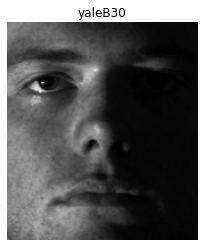

[](https://classroom.github.com/online_ide?assignment_repo_id=7866424&assignment_repo_type=AssignmentRepo)


# Task 5
### Download Data From [Extended Yale Dataset](http://vision.ucsd.edu/~leekc/ExtYaleDatabase/ExtYaleB.html)


```python
import matplotlib.pyplot as plt
from mpl_toolkits.axes_grid1 import ImageGrid
import numpy as np
import os
import pandas as pd
```

### Read all images names from each folder 
### make full path to each image

### 38 subject * 64 illumination each of shape (m  rows 192, n cols 168) cropped and alligned


```python
from test_utils import prepare_images_pths, read_pgm, plot_figure, get_unique_subjects, plot_imgs_mesh,  get_subject_pgms, vectors_matrix, plot_reshape_vector, fix_corrupted_vectors, get_avg_face

```


```python
base_pth = "./CroppedYale"
subjects_imgs_pth, subjects_imgs_names = prepare_images_pths(base_pth)

rand_int = np.random.randint(0,len(subjects_imgs_pth))
image = read_pgm(f"{base_pth}/{subjects_imgs_pth[rand_int]}", byteorder='<')
subject = subjects_imgs_pth[rand_int].split("/")[0]
plot_figure(image, label=f"{subject}")
```


    

    


### Read PGM Files

### Make grid of first image from training subject images (36 subject)


```python
unique_imgs_pgm =  get_unique_subjects(base_pth, subjects_imgs_names)
plot_imgs_mesh(unique_imgs_pgm, 6, 6)
```


    

    


### make grid of yaleB01 subject all images with different illumination


```python
subject_pgms = get_subject_pgms(base_pth, subjects_imgs_names, 0)
plot_imgs_mesh(subject_pgms, 8, 8)
```


    

    


### X Matrix  for training data (chossing firsr 36 subject from total 38 subject)
-  Flatten pgms to colums 
-  Substract avg_face


```python
training_pgms_vectors = vectors_matrix(base_pth)
plot_reshape_vector(training_pgms_vectors, vector_num=6)
```

    e:\SBME\2022-2ndtern\cv\tasks\task1-python\assignment-5-cv-2022-sbe-404-team_10\test\test_utils.py:172: VisibleDeprecationWarning: Creating an ndarray from ragged nested sequences (which is a list-or-tuple of lists-or-tuples-or ndarrays with different lengths or shapes) is deprecated. If you meant to do this, you must specify 'dtype=object' when creating the ndarray
      training_pgms_arr = np.array(training_pgms) #, dtype=object
    e:\SBME\2022-2ndtern\cv\tasks\task1-python\assignment-5-cv-2022-sbe-404-team_10\test\test_utils.py:179: VisibleDeprecationWarning: Creating an ndarray from ragged nested sequences (which is a list-or-tuple of lists-or-tuples-or ndarrays with different lengths or shapes) is deprecated. If you meant to do this, you must specify 'dtype=object' when creating the ndarray
      training_pgms_vectors = np.array(training_pgms_vectors) #, dtype=object
    


    

    


```python
fixed_training_pgms_vectors = fix_corrupted_vectors(training_pgms_vectors)

avg_face = get_avg_face(fixed_training_pgms_vectors)    

img_reshaped = avg_face.reshape(192,168)
plot_figure(img_reshaped, label="avg_face")
```


    

    


## Singular Value Decomposition (SVD) ~ PCA (Eigen Analysis)

            > write some eqns


```python
from test_utils import X_matrix, svd_simultaneous_power_iteration
```


```python
m= 192
n= 168

avg_face = get_avg_face(fixed_training_pgms_vectors)    

X = X_matrix(base_pth, s_strat=0, s_end=36)

U, S, VT = np.linalg.svd(X,full_matrices=0)
print("U shape: ",U.shape)
print("S shape: ",S.shape)
print("VT shape: ",VT.shape)

fig1 = plt.figure()
ax1 = fig1.add_subplot(121)
img_avg = ax1.imshow(avg_face.reshape(m,n))
img_avg.set_cmap('gray')
plt.axis('off')

ax2 = fig1.add_subplot(122)
img_u1 = ax2.imshow(np.reshape(U[:,0],(m,n)))
img_u1.set_cmap('gray')
plt.axis('off')

plt.show()

```

    Matrix Shape:  (32256, 2296)
    U shape:  (32256, 2296)
    S shape:  (2296,)
    VT shape:  (2296, 2296)
    


    

    


```python
# load and save a matrix to be used in the gui

# np.savetxt('U.txt', U[:, :300])
# U = np.loadtxt('U.txt')
```

## Implementation of SVD using Power iteration algorithm


### Calcualtion of k eigenvectors and eigen values 
- K   > time
- 20  > 4.5 sec
- 50  > 10 sec
- 80  > 22 sec 
- 100 > 30 sec
- 120 > 1 min 3 sec 
- 150 > 59 sec 
- 180 > 1 min 39 sec 
- 200 > 1 min 25 sec 
- 800 > 7 min 42 sec


```python
left_vecs_50, singular_values_50, right_vecs_50 = svd_simultaneous_power_iteration(X, 50)
```


```python
left_vecs_200, singular_values_200, right_vecs_200 = svd_simultaneous_power_iteration(X, 200)
```


```python
left_vecs_800, singular_values_800, right_vecs_800 = svd_simultaneous_power_iteration(X, 800)
```

## Testing 
### np.svd and our svd reached very close performance estimating the `eigenfaces` 
> the cell bellow show random eigenfaces from both methods


```python

rand_int = np.random.randint(0,80)

fig1 = plt.figure()
ax1 = fig1.add_subplot(121)
img_avg = ax1.imshow(np.reshape(left_vecs_200[:,rand_int],(m,n)))
img_avg.set_cmap('gray')
plt.axis('off')

ax2 = fig1.add_subplot(122)
img_u1 = ax2.imshow(np.reshape(U[:,rand_int],(m,n)))
img_u1.set_cmap('gray')
plt.axis('off')

plt.show()

# left_ours                 #np.svd
```


    

    


```python
testing_pgms_vectors = vectors_matrix(base_pth, start=36, end=38)
plot_reshape_vector(testing_pgms_vectors, vector_num=100)
```


    

    


### Test Images subjects 37, 38

### reconstructing the test image by using Ur of eigenvectors `tradeoff between sparsity and accuracy`

### reconstruction using np.svd


```python
## Now show eigenface reconstruction of image that was omitted from test set

testFace =  img_flat =  testing_pgms_vectors[80].reshape(-1) # 2d to 1d# First face of person 37
plot_figure(np.reshape(testFace,(m,n)), label="test_img")

reconstructions = []
r_list = [50, 100, 200, 400, 800, 1600]
testFaceMS = testFace - avg_face
for r in r_list:
    alpha = U[:,:r].T @ testFaceMS
    reconFace = avg_face + U[:,:r]  @ alpha
    reconstructions.append(np.reshape(reconFace,(m,n)))

fig = plt.figure(figsize=(8, 8))
grid = ImageGrid(fig, 111,  # similar to subplot(111)
                 nrows_ncols=(2, 3),  # creates 2x2 grid of axes
                 axes_pad=0.1,  # pad between axes in inch.
                 )

for ax, im in zip(grid, reconstructions):
    # Iterating over the grid returns the Axes.
    ax.axis('off')    
    ax.imshow(im, cmap="gray")

plt.show()


```


    

    


    

    


### reconstruction using our implementation of svd 
> Althought the eigen vector from our method is only calculated up to 800 component compared to 2296 using np.svd; we achieved similar reconstruction using r values upto 800


```python
## Now show eigenface reconstruction of image that was omitted from test set

testFace =  img_flat =  testing_pgms_vectors[80].reshape(-1) # 2d to 1d# First face of person 37
plot_figure(np.reshape(testFace,(m,n)), label="test_img")


reconstructions = []
r_list = [50, 100, 150 , 200, 400, 800]
testFaceMS = testFace - avg_face
for r in r_list:
    alpha = left_vecs_800[:,:r].T @ testFaceMS
    reconFace = avg_face + left_vecs_800[:,:r]  @ alpha
    reconstructions.append(np.reshape(reconFace,(m,n)))


fig = plt.figure(figsize=(8, 8))
grid = ImageGrid(fig, 111,  # similar to subplot(111)
                 nrows_ncols=(2, 3),  # creates 2x2 grid of axes
                 axes_pad=0.1,  # pad between axes in inch.
                 )

for ax, im in zip(grid, reconstructions):
    # Iterating over the grid returns the Axes.
    ax.axis('off')    
    ax.imshow(im, cmap="gray")

plt.show()


```


    

    


    

    


## X_test Matrix Reconstruction


```python
X_test = X_matrix(base_pth, s_strat=36, s_end=38)

# X = training_pgms_vectors >> reshape and vector to (192,168)
rand_int = np.random.randint(0,X_test.shape[1])
img_reshaped = X_test.T[rand_int].reshape(m,n)
plot_figure(img_reshaped, label="rand img - avg_face")


```

    Matrix Shape:  (32256, 128)
    


    

    


### Projecting all 128 test imgs `64 each person` on only 4 components of eigenfaces matrix results in only 4 values for each img and by plotting clusters of projections of combinations of two components we can see that:

**principal components (5 , 6) and (6 , 7)  can be used to recognize the two persons from each other with great accuracy using `linear regression` or `svm` or `k-means clustering` or any ML algorithm and no need to cover 90% of eigenfaces**

> project new image on PC 5, 6 will result in only 2x1 array a very simple ML algorithm can classify the persons from each other without fancy matching CV algorithms.    


```python
def PCA_projection(U_matrix, X_matrix, PCA_idx=[5,6,7]):
    PCA_P = U_matrix[ : , PCA_idx-np.ones_like(PCA_idx)].T @ X_matrix
    return PCA_P


def plot_cluster(PCA_P1, PCA_P2, pc1, pc2):
    '''
    pc1: idx of principal component from PCAmodes
    '''    
    plt.plot(PCA_P1[ pc1, : ], PCA_P1[ pc2, : ],'^',color='k',label='Person 38')
    plt.plot(PCA_P2[ pc1, : ], PCA_P2[ pc2, : ],'o',color='r',label='Person 39')
    plt.legend()
    plt.show()


PCAmodes = [5,6,7,8]
PCA_P1 = PCA_projection(U, X_test[ : ,    : 64], PCA_idx= PCAmodes)
PCA_P2 = PCA_projection(U, X_test[ : , 64 :   ], PCA_idx= PCAmodes)


plot_cluster(PCA_P1,PCA_P2, pc1=0 , pc2=1)
plot_cluster(PCA_P1,PCA_P2, pc1=1 , pc2=2)
plot_cluster(PCA_P1,PCA_P2, pc1=1 , pc2=3)

```


    

    


    

    


    

    


```python
df_38 = pd.DataFrame(PCA_P1.T, columns = ['PC5','PC6','PC7','PC8'])
df_38['Person'] = 0

df_39 = pd.DataFrame(PCA_P2.T, columns = ['PC5','PC6','PC7','PC8'])
df_39['Person'] = 1

df = pd.concat([df_38,df_39], axis=0)

```


```python
df
```


<div>
<style scoped>
    .dataframe tbody tr th:only-of-type {
        vertical-align: middle;
    }

    .dataframe tbody tr th {
        vertical-align: top;
    }

    .dataframe thead th {
        text-align: right;
    }
</style>
<table border="1" class="dataframe">
  <thead>
    <tr style="text-align: right;">
      <th></th>
      <th>PC5</th>
      <th>PC6</th>
      <th>PC7</th>
      <th>PC8</th>
      <th>Person</th>
    </tr>
  </thead>
  <tbody>
    <tr>
      <th>0</th>
      <td>-308.117910</td>
      <td>915.118454</td>
      <td>-35.370694</td>
      <td>-68.053428</td>
      <td>0</td>
    </tr>
    <tr>
      <th>1</th>
      <td>-245.162662</td>
      <td>939.293206</td>
      <td>-58.598719</td>
      <td>62.055362</td>
      <td>0</td>
    </tr>
    <tr>
      <th>2</th>
      <td>-334.025043</td>
      <td>1544.788015</td>
      <td>-42.846505</td>
      <td>-232.408095</td>
      <td>0</td>
    </tr>
    <tr>
      <th>3</th>
      <td>-475.495976</td>
      <td>501.031016</td>
      <td>4.561834</td>
      <td>5.084979</td>
      <td>0</td>
    </tr>
    <tr>
      <th>4</th>
      <td>-348.259416</td>
      <td>941.116854</td>
      <td>-148.096245</td>
      <td>44.078498</td>
      <td>0</td>
    </tr>
    <tr>
      <th>...</th>
      <td>...</td>
      <td>...</td>
      <td>...</td>
      <td>...</td>
      <td>...</td>
    </tr>
    <tr>
      <th>59</th>
      <td>1108.557417</td>
      <td>-1209.387889</td>
      <td>2082.467530</td>
      <td>136.992127</td>
      <td>1</td>
    </tr>
    <tr>
      <th>60</th>
      <td>769.361378</td>
      <td>-2057.041818</td>
      <td>901.597311</td>
      <td>34.249722</td>
      <td>1</td>
    </tr>
    <tr>
      <th>61</th>
      <td>-3234.508704</td>
      <td>-124.908472</td>
      <td>642.803018</td>
      <td>587.065213</td>
      <td>1</td>
    </tr>
    <tr>
      <th>62</th>
      <td>-2987.437325</td>
      <td>-661.520561</td>
      <td>2974.284540</td>
      <td>882.421875</td>
      <td>1</td>
    </tr>
    <tr>
      <th>63</th>
      <td>-1070.529464</td>
      <td>-677.708733</td>
      <td>2802.231545</td>
      <td>352.278975</td>
      <td>1</td>
    </tr>
  </tbody>
</table>
<p>128 rows × 5 columns</p>
</div>


```python
from sklearn.model_selection import train_test_split

df_y = df.pop('Person')
df_x = df
df_5_6 = df_x[['PC5', 'PC6']]

x_train,x_test,y_train,y_test_5_6 = train_test_split(df_5_6, df_y, test_size=0.3, random_state=40)
```


```python
from sklearn.svm import SVC
from sklearn.decomposition import PCA as RandomizedPCA
from sklearn.pipeline import make_pipeline
from sklearn.model_selection import GridSearchCV


svc = SVC(kernel='rbf', class_weight='balanced')
model = make_pipeline(svc)

param_grid = {'svc__C': [1, 5, 10, 50],
              'svc__gamma': [0.0001, 0.0005, 0.001, 0.005]}
grid = GridSearchCV(model, param_grid)

%time grid.fit(x_train, y_train)
print(grid.best_params_)

model = grid.best_estimator_
yfit_5_6 = model.predict(x_test)


model = grid.best_estimator_
yfit_5_6 = model.predict(x_test)

from sklearn.metrics import classification_report
print(classification_report(y_test_5_6, yfit_5_6,))
```

    Wall time: 404 ms
    {'svc__C': 5, 'svc__gamma': 0.0001}
                  precision    recall  f1-score   support
    
               0       0.92      0.60      0.73        20
               1       0.69      0.95      0.80        19
    
        accuracy                           0.77        39
       macro avg       0.81      0.77      0.76        39
    weighted avg       0.81      0.77      0.76        39
    
    


```python
from sklearn.metrics import confusion_matrix
import seaborn as sns

mat = confusion_matrix(y_test_5_6, yfit_5_6)
sns.heatmap(mat.T, square=True, annot=True, fmt='d', cbar=False,
            xticklabels= [0,1],
            yticklabels= [0,1])
plt.xlabel('true label')
plt.ylabel('predicted label')
```


    Text(91.68, 0.5, 'predicted label')


    

    


```python
from sklearn.metrics import roc_curve
from sklearn.metrics import auc

# Compute fpr, tpr, thresholds and roc auc
fpr, tpr, thresholds = roc_curve(y_test_5_6, yfit_5_6)
roc_auc = auc(fpr, tpr)

# Plot ROC curve
plt.plot(fpr, tpr, label='ROC curve (area = %0.3f)' % roc_auc)
plt.plot([0, 1], [0, 1], 'k--')  # random predictions curve
plt.xlim([0.0, 1.0])
plt.ylim([0.0, 1.0])
plt.xlabel('False Positive Rate or (1 - Specifity)')
plt.ylabel('True Positive Rate or (Sensitivity)')
plt.title('Receiver Operating Characteristic')
plt.legend(loc="lower right")

```


    <matplotlib.legend.Legend at 0x22405613c40>


    

    


```python
from test_utils import get_roc_data
```


```python
y_test1, yfit1 = get_roc_data(U, X_test, 5, 6)
y_test2, yfit2 = get_roc_data(U, X_test, 5, 8)
y_test3, yfit3 = get_roc_data(U, X_test, 5, 15)
y_test4, yfit4 = get_roc_data(U, X_test, 5, 20)
```

    {'svc__C': 1, 'svc__gamma': 0.0005}
    {'svc__C': 5, 'svc__gamma': 0.0001}
    {'svc__C': 1, 'svc__gamma': 0.005}
    {'svc__C': 1, 'svc__gamma': 0.005}
    


```python
from sklearn import metrics
import numpy as np
import matplotlib.pyplot as plt

plt.figure(0).clf()

fpr, tpr, thresh = metrics.roc_curve(y_test1, yfit1)
auc = metrics.roc_auc_score(y_test1, yfit1)
plt.plot(fpr,tpr,label="pc5:6, auc="+str(np.round(auc,2)))

fpr, tpr, thresh = metrics.roc_curve(y_test2, yfit2)
auc = metrics.roc_auc_score(y_test2, yfit2)
plt.plot(fpr,tpr,label="pc5:8, auc="+str(np.round(auc,2)))

fpr, tpr, thresh = metrics.roc_curve(y_test3, yfit3)
auc = metrics.roc_auc_score(y_test3, yfit3)
plt.plot(fpr,tpr,label="pc5:15, auc="+str(np.round(auc,2)))

fpr, tpr, thresh = metrics.roc_curve(y_test4, yfit4)
auc = metrics.roc_auc_score(y_test4, yfit4)
plt.plot(fpr,tpr,label="pc5:20, auc="+str(np.round(auc,2)))

plt.legend(loc=0)
```


    <matplotlib.legend.Legend at 0x224056182b0>


    

    


```python

```


```python
import matplotlib.pyplot as plt
from mpl_toolkits.axes_grid1 import ImageGrid
import numpy as np
import pandas as pd
import os
```


```python
from test_utils import prepare_images_pths
```


```python
base_pth = "./CroppedYale"
subjects_imgs_pth, subjects_imgs_names = prepare_images_pths(base_pth)    

```


```python
# list of lists of subject imgs
import shutil
unique_subject = []
for folder in subjects_imgs_names:
    unique_subject.append(folder[1])
    unique_subject.append(folder[2])
    unique_subject.append(folder[10])
    unique_subject.append(folder[15])
    unique_subject.append(folder[20])
    unique_subject.append(folder[25])
    unique_subject.append(folder[50])

unique_imgs_pth = []
for name in unique_subject:
    folder_name = name.split("_")[0]
    unique_imgs_pth.append(f"{folder_name}/{name}")

for i in range(len(unique_imgs_pth)):
    shutil.copy(f"{base_pth}/{unique_imgs_pth[i]}", f"unique_faces/")
    
        
```


```python
subjects_imgs = os.listdir("./unique_faces")
len(subjects_imgs)

# 228 img 6 for each subject 38x6
recognition_pgms = []
for img in subjects_imgs:
        pgm = plt.imread(f"./unique_faces/{img}")
        recognition_pgms.append(pgm)
        
m = 192
n = 168 
recognition_pgms_arr = np.array(recognition_pgms) #, dtype=object
recognition_pgms_vectors = []
for img in recognition_pgms_arr:
    img_flat = img.flatten()
    recognition_pgms_vectors.append(img_flat)

recognition_pgms_vectors = np.array(recognition_pgms_vectors) #, dtype=object        

```


```python
# testing_pgms_arr# X = training_pgms_vectors >> reshape and vector to (192,168)
rand_int = np.random.randint(0,len(recognition_pgms_arr))
img_reshaped = recognition_pgms_vectors[rand_int].reshape(m,n)
print(img_reshaped.shape)
plt.figure(figsize=(4., 4.))
plt.axis('off')   
plt.imshow(img_reshaped, plt.cm.gray)
plt.show()    

```

    (192, 168)
    


    

    


```python
avg_face = np.loadtxt('avg_face.txt', dtype=int) #(32256,)
```


```python
# Turn to numppy array of lists
vectors_list = []
for vector in recognition_pgms_vectors:
    vectors_list.append(vector.tolist())

# n_imgs x (nxm)
print("vector_list shape",np.array(vectors_list).shape)  

# (nxm) x k
vectors_list =  np.array(vectors_list).T 
print("vector_list.T shape",np.array(vectors_list).shape)   

# copy avg face n times
avg_face_list  = []
for i in range(len(vectors_list[1])):
    avg_face_list.append(avg_face.tolist())

avg_face_list =  np.array(avg_face_list).T

    
X_recognition = vectors_list - avg_face_list
print("X_recognition shape",X_recognition.shape)

# X = training_pgms_vectors >> reshape and vector to (192,168)
rand_int = np.random.randint(0,len(recognition_pgms_arr))
img_reshaped = X_recognition.T[rand_int].reshape(m,n)
plt.figure(figsize=(4., 4.))
plt.axis('off')   
plt.imshow(img_reshaped, plt.cm.gray)
plt.show()    

```

    vector_list shape (266, 32256)
    vector_list.T shape (32256, 266)
    X_recognition shape (32256, 266)
    


    

    


```python

U = np.loadtxt('U.txt')
```


```python
from test_utils import get_roc_data_recognition
from sklearn.metrics import classification_report
```


```python
y_test, yfit = get_roc_data_recognition(U, X_recognition, 5,50,data_shape=(len(unique_imgs_pth),7))

print(classification_report(y_test, yfit))
```

    c:\Users\Mohamed Abdelaziz\AppData\Local\Programs\Python\Python39\lib\site-packages\sklearn\model_selection\_split.py:666: UserWarning: The least populated class in y has only 3 members, which is less than n_splits=5.
      warnings.warn(("The least populated class in y has only %d"
    

                  precision    recall  f1-score   support
    
               1       1.00      1.00      1.00         3
               2       1.00      1.00      1.00         3
               3       1.00      1.00      1.00         3
               4       1.00      1.00      1.00         2
               5       0.67      1.00      0.80         2
               6       1.00      1.00      1.00         3
               7       0.40      1.00      0.57         2
               8       0.00      0.00      0.00         2
               9       0.67      0.67      0.67         3
              10       1.00      0.50      0.67         2
              13       1.00      0.67      0.80         3
              15       1.00      0.33      0.50         3
              16       0.00      0.00      0.00         1
              17       0.00      0.00      0.00         1
              18       0.75      1.00      0.86         3
              19       0.67      0.67      0.67         3
              20       1.00      1.00      1.00         1
              21       1.00      0.67      0.80         3
              22       0.33      1.00      0.50         1
              23       1.00      1.00      1.00         1
              24       1.00      0.67      0.80         3
              25       1.00      1.00      1.00         4
              26       1.00      1.00      1.00         2
              27       1.00      0.50      0.67         2
              28       1.00      1.00      1.00         3
              29       1.00      1.00      1.00         1
              30       1.00      0.50      0.67         2
              31       0.00      0.00      0.00         1
              32       1.00      0.33      0.50         3
              33       1.00      1.00      1.00         2
              34       0.60      1.00      0.75         3
              36       1.00      0.67      0.80         3
              37       0.50      1.00      0.67         3
              38       0.75      1.00      0.86         3
    
        accuracy                           0.78        80
       macro avg       0.77      0.74      0.72        80
    weighted avg       0.83      0.78      0.77        80
    
    

    c:\Users\Mohamed Abdelaziz\AppData\Local\Programs\Python\Python39\lib\site-packages\sklearn\metrics\_classification.py:1245: UndefinedMetricWarning: Precision and F-score are ill-defined and being set to 0.0 in labels with no predicted samples. Use `zero_division` parameter to control this behavior.
      _warn_prf(average, modifier, msg_start, len(result))
    c:\Users\Mohamed Abdelaziz\AppData\Local\Programs\Python\Python39\lib\site-packages\sklearn\metrics\_classification.py:1245: UndefinedMetricWarning: Precision and F-score are ill-defined and being set to 0.0 in labels with no predicted samples. Use `zero_division` parameter to control this behavior.
      _warn_prf(average, modifier, msg_start, len(result))
    c:\Users\Mohamed Abdelaziz\AppData\Local\Programs\Python\Python39\lib\site-packages\sklearn\metrics\_classification.py:1245: UndefinedMetricWarning: Precision and F-score are ill-defined and being set to 0.0 in labels with no predicted samples. Use `zero_division` parameter to control this behavior.
      _warn_prf(average, modifier, msg_start, len(result))
    


```python
y_test, yfit = get_roc_data_recognition(U, X_recognition, 5,300,data_shape=(len(unique_imgs_pth),7))
print(classification_report(y_test, yfit))
```

    c:\Users\Mohamed Abdelaziz\AppData\Local\Programs\Python\Python39\lib\site-packages\sklearn\model_selection\_split.py:666: UserWarning: The least populated class in y has only 3 members, which is less than n_splits=5.
      warnings.warn(("The least populated class in y has only %d"
    

                  precision    recall  f1-score   support
    
               1       1.00      1.00      1.00         3
               2       1.00      0.67      0.80         3
               3       1.00      1.00      1.00         3
               4       1.00      1.00      1.00         2
               5       1.00      1.00      1.00         2
               6       1.00      1.00      1.00         3
               7       0.40      1.00      0.57         2
               8       0.00      0.00      0.00         2
               9       0.67      0.67      0.67         3
              10       0.20      0.50      0.29         2
              13       1.00      0.67      0.80         3
              15       1.00      0.33      0.50         3
              16       0.00      0.00      0.00         1
              17       1.00      1.00      1.00         1
              18       1.00      1.00      1.00         3
              19       1.00      0.67      0.80         3
              20       1.00      1.00      1.00         1
              21       1.00      0.67      0.80         3
              22       0.50      1.00      0.67         1
              23       1.00      1.00      1.00         1
              24       1.00      0.67      0.80         3
              25       0.80      1.00      0.89         4
              26       1.00      1.00      1.00         2
              27       1.00      0.50      0.67         2
              28       1.00      1.00      1.00         3
              29       1.00      1.00      1.00         1
              30       1.00      0.50      0.67         2
              31       1.00      1.00      1.00         1
              32       0.67      0.67      0.67         3
              33       1.00      1.00      1.00         2
              34       1.00      0.67      0.80         3
              35       0.00      0.00      0.00         0
              36       1.00      0.67      0.80         3
              37       0.50      1.00      0.67         3
              38       0.75      1.00      0.86         3
    
        accuracy                           0.79        80
       macro avg       0.81      0.77      0.76        80
    weighted avg       0.86      0.79      0.79        80
    
    

    c:\Users\Mohamed Abdelaziz\AppData\Local\Programs\Python\Python39\lib\site-packages\sklearn\metrics\_classification.py:1245: UndefinedMetricWarning: Precision and F-score are ill-defined and being set to 0.0 in labels with no predicted samples. Use `zero_division` parameter to control this behavior.
      _warn_prf(average, modifier, msg_start, len(result))
    c:\Users\Mohamed Abdelaziz\AppData\Local\Programs\Python\Python39\lib\site-packages\sklearn\metrics\_classification.py:1245: UndefinedMetricWarning: Recall and F-score are ill-defined and being set to 0.0 in labels with no true samples. Use `zero_division` parameter to control this behavior.
      _warn_prf(average, modifier, msg_start, len(result))
    c:\Users\Mohamed Abdelaziz\AppData\Local\Programs\Python\Python39\lib\site-packages\sklearn\metrics\_classification.py:1245: UndefinedMetricWarning: Precision and F-score are ill-defined and being set to 0.0 in labels with no predicted samples. Use `zero_division` parameter to control this behavior.
      _warn_prf(average, modifier, msg_start, len(result))
    c:\Users\Mohamed Abdelaziz\AppData\Local\Programs\Python\Python39\lib\site-packages\sklearn\metrics\_classification.py:1245: UndefinedMetricWarning: Recall and F-score are ill-defined and being set to 0.0 in labels with no true samples. Use `zero_division` parameter to control this behavior.
      _warn_prf(average, modifier, msg_start, len(result))
    c:\Users\Mohamed Abdelaziz\AppData\Local\Programs\Python\Python39\lib\site-packages\sklearn\metrics\_classification.py:1245: UndefinedMetricWarning: Precision and F-score are ill-defined and being set to 0.0 in labels with no predicted samples. Use `zero_division` parameter to control this behavior.
      _warn_prf(average, modifier, msg_start, len(result))
    c:\Users\Mohamed Abdelaziz\AppData\Local\Programs\Python\Python39\lib\site-packages\sklearn\metrics\_classification.py:1245: UndefinedMetricWarning: Recall and F-score are ill-defined and being set to 0.0 in labels with no true samples. Use `zero_division` parameter to control this behavior.
      _warn_prf(average, modifier, msg_start, len(result))
    


```python
import numpy as np
import matplotlib.pyplot as plt
from sklearn import svm, datasets
from sklearn.metrics import roc_curve, auc
from sklearn.model_selection import train_test_split
from sklearn.preprocessing import label_binarize
from sklearn.multiclass import OneVsRestClassifier
from test_utils import get_df_dataframes, plot_roc_multiclass


X, y = get_df_dataframes(U,X_recognition, 5,300, data_shape=(len(unique_imgs_pth),7))

persons_classes = [i for i in range(1,39)]
# Binarize the output
y = label_binarize(y, classes=persons_classes)
n_classes = y.shape[1]

# # shuffle and split training and test sets
X_train, X_test, y_train, y_test = train_test_split(X, y, test_size=.3,
                                                    random_state=0)

# Learn to predict each class against the other
classifier = OneVsRestClassifier(svm.SVC(kernel='linear', probability=True,
                                 random_state=40))
y_pred = classifier.fit(X_train, y_train).decision_function(X_test)


```


```python
plot_roc_multiclass(y_test, y_pred, start=5, end=10)
```


    

    


```python
plot_roc_multiclass(y_test, y_pred, start=11, end=15)
```


    

    


```python
plot_roc_multiclass(y_test, y_pred, start=33, end=36)
```


    

    

